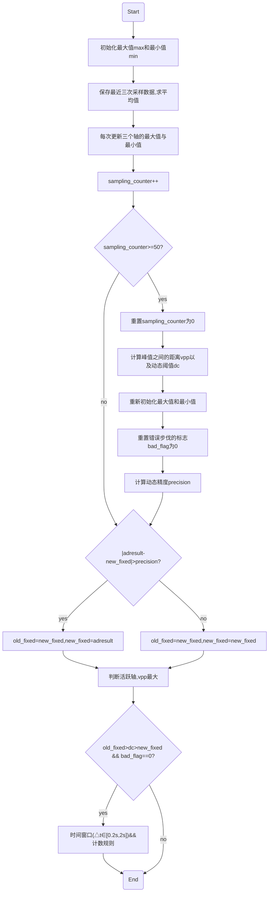
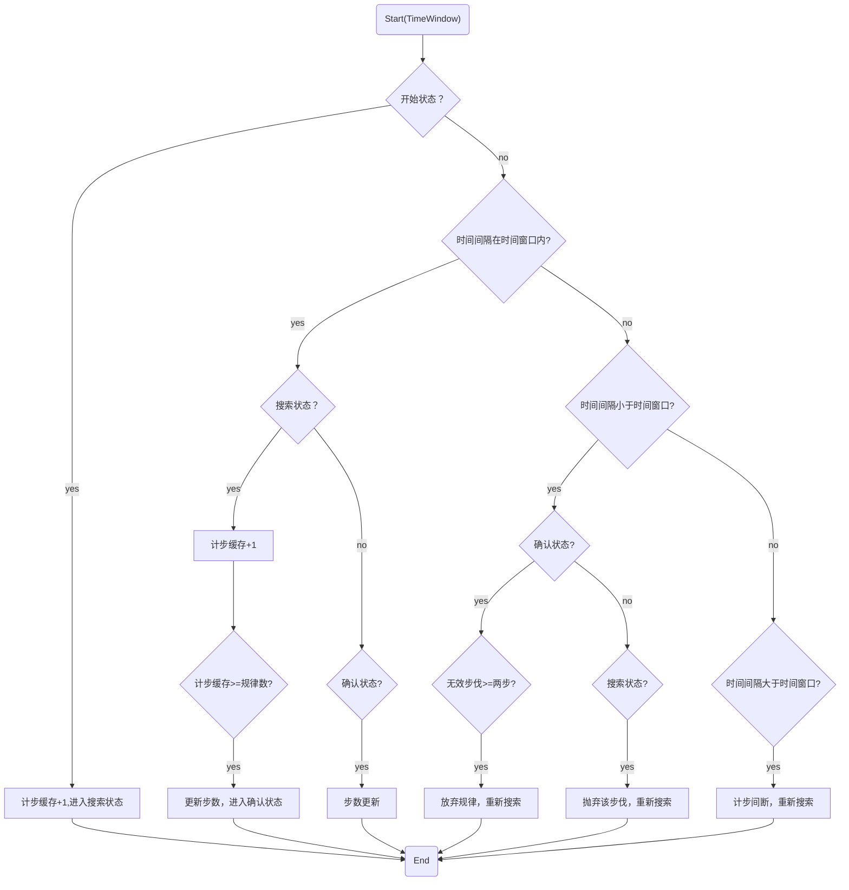

### 计步算法
- 定义步数
- 计步算法
- 算法代码
- 算法不足
- 需要解决问题

#### 定义步数


​		正常人走路时手臂摆动呈现周期性变化，将ADXL345三轴加速度传感器和一重物悬挂并左右摆动模拟人走路时手臂的摆动。ADXL345三轴加速度传感器处于平衡状态时三个轴的方向为图1，此时三个轴加速度数据情况见图2。图3、4分别为传感器沿y轴方向左右摆动情况与对应时刻各轴加速度变化情况，由图知z轴加速度几乎保持不变，x、y轴数据均呈现周期性变化，且y轴为正弦波。正常人走路时手臂前后摆动与该过程类似，由于竖直方向和沿手臂摆动方向坐标轴加速度变化较大（此处为x、y轴），所以将一步定义为沿运动方向加速度数据从一个波峰到波谷（或波谷到波峰）的过程或沿x轴方向经过一次波谷的过程。

<center>
    
    
</center>

<center>
    
    
</center>

​		

#### 计步算法

##### 采样滤波

​		为使信号波形变得平滑进行均值滤波，即取多组x，y，z三轴数据，最后分别求取平均值 adresult 作为输出结果，完成初步滤波。所取样本越多，输出结果越平滑，但计算时间越长，此处每四组进行一次计算。

##### 计算动态阈值与动态精度

​		动态阈值 (dc) ：系统每取50次样本更新一次三轴加速度的最大值与最小值，平均值 (max+min)/2 称为“动态阈值”。利用此阈值可以进行判断个体是否迈出步伐。由于此阈值每50次采样更新一次，所以它是动态变化的，这种选择具有自适应性。

​		动态精度 (precision) ：可以利用一个线性位移寄存器加上与设定的动态精度来消除高频噪声。动态精度根据最大值与最小值之差绝对值进行分阶段定义。

##### 利用线性位移寄存器消除高频噪声

​		该线性位移寄存器含有两个寄存器：sample_new 寄存器和 sample_old 寄存器，寄存器中数据分别称为 new_fixed 和 old_fixed 。当新数据来到时，new_fixed 无条件移入sample_old 寄存器；adresult是否移入 sample_new 寄存器需要满足以下条件：当加速度变化（|adresult-new_fixed|）大于动态精度时，adresult 移入sample_new 寄存器 ，否则 sample_new 寄存器保持不变。线性移位寄存器即通过该方法消除高频噪声。

##### 有效步伐定义

​		步伐迈出的定义为：竖直方向——当加速度曲线跨过动态阈值下方时，加速度曲线斜率为负值 (new_fixed < dc < old_fixed) 。沿手臂摆动方向——加速度曲线跨过动态阈值 ((new_fixed < dc < old_fixed) or (new_fixed > dc > old_fixed)) 。

​		活跃轴检测：在进行步伐迈出判断前，首先利用最大值与最小值差值的绝对值 (vpp) 对x，y，z轴加速度变化最大的轴进行判断，并将该轴作为步伐计数的判断依据。

​		仅进行上述判断，步伐计数过于敏感，为了避免将跑步和走路之外的非常迅速或者缓慢的振动也认为成步伐，此处利用“时间窗口”和“计数规则”来排除无效步伐并找到真正有节奏的步伐。

​		时间窗口：时间窗口用于排除无效振动。通过查阅文献知正常人步行和跑步的最大频率不会超过短跑冠军博尔特的百米赛跑世界纪录，即百米耗时 9.6s 约跑了 50 步，故每步间隔 0.2s，最慢步行速度为 2 秒 1 步。因此，两个有效步伐的时间间隔应该在时间窗口 [ 0.2s , 2.0s ] 之内，时间间隔超出时间窗口的步伐都应该排除。

​		计数规则：计数规则用来确定步伐是否在一个节奏模式。步伐计数过程有三个工作状态：开始状态；搜索状态；确认状态。如果处于开始状态，则直接在计步缓存中记一步，然后进入搜索状态。搜索状态时，检测到有效步伐时，则在计步缓存中记一步，连续经过四次有效步伐则证明存在某种节奏，步伐计数刷新和显示结果，进入确认状态。确认状态下，每经过一次有效步伐，步伐计数加1；当发现无效步伐时，如果无效步伐时间间隔小于时间窗口并连续经过两次无效步伐或者当无效步伐时间间隔大于时间窗口时，重新返回搜索状态，重新搜索四个连续有效步伐。





#### 算法代码

##### 获得原始数据

```python
'''python控制串口接收数据，并将数据存入output.txt'''
import serial
import time

my_serial = serial.Serial(comport='COM4', baudrate=9600, bytesize=8, parity='N', stopbits=1, timeout=None, xonxoff=0, rtscts=0)
file_output = open('C:\\Users\\Fu\\Desktop\\output.txt', mode='w')

if my_serial.isOpen():
    print('open success')

start = time.clock()
for i in range (1000):
    a = my_serial.read(6)
    ret = a.hex()
    file_output.write(ret+'\n')
    print(ret+'\n')
end = time.clock()
print("final is in ", end - start)

file_output.close()
```

利用三轴加速度传感器模拟人走路时手臂摆动情况，共摆动31次，将得到的三轴加速度原始数据记录在[output.txt](output.txt)中。此处选用50Hz 数据输出速率，取样1000次，共用时20秒，平均一步0.65秒。

##### 数据处理

```python
'''处理接收数据，将处理数据存入operation.txt'''
import matplotlib.pyplot as plt

file_output=open('C:\\Users\\Fu\\Desktop\\output.txt', mode='r')
file_operation=open('C:\\Users\\Fu\\Desktop\\operation.txt', mode='w')

line_list=[] , lines=[] #写txt
x_list=[] , y_list=[] , z_list=[] , time=[] #画图

for line in file_output:
    x1 = '{:08b}'.format(int(line[2:4], 16))
    x0 = '{:08b}'.format(int(line[0:2], 16))
    y1 = '{:08b}'.format(int(line[6:8], 16))
    y0 = '{:08b}'.format(int(line[4:6], 16))
    z1 = '{:08b}'.format(int(line[10:12], 16))
    z0 = '{:08b}'.format(int(line[8:10], 16))
    x_whole=x1+x0
    y_whole=y1+y0
    z_whole=z1+z0
    x_bin = x_whole[4:]
    y_bin = y_whole[4:]
    z_bin = z_whole[4:]
   
    if line[2]=='0':
        x=int(x_bin,2)
    else:
        x=-(4095-int(x_bin,2)+1)
    if line[6]=='0':
        y=int(y_bin,2)
    else:
        y=-(4095-int(y_bin,2)+1)
    if line[10]=='0':
        z=int(z_bin,2)
    else:
        z=-(4095-int(z_bin,2)+1)
    line_list=[x, y, z]
    lines.append(line_list)
    x_list.append(x)
    y_list.append(y)
    z_list.append(z)
    
for i in lines:
    file_operation.write(str(i) + '\n')
file_operation.close()

#画出三个轴的图像
for i in range(100):
    time.append(i)
line1 = plt.plot(time,x_list, 'dodgerblue')
line2 = plt.plot(time,y_list, 'green')
line3 = plt.plot(time,z_list,'gold')
plt.show()
```

对原始数据进行处理并将结果保存在[operation.txt](operation.txt)中，得到的加速度数据图像如下。y轴图像波峰波谷共有31个，x轴共31个波谷，与加速度传感器摆动次数相同。

<center></center>
##### 计步算法

```python
# 初始化处理
import matplotlib.pyplot as plt

sample = 50
samples = 1000

list = []  # [x,y,z]
lists = []  # [[x,y,z],[x,y,z],...]

x_list = []  # [x,x,x,...]
y_list = []
z_list = []
time = []

sampling_counter = 0
_array0 = [1, 1, 1, 1]
_array1 = [1, 1, 1, 1]
_array2 = [0, 0, 0, 0]
_array3 = [0, 0, 0, 0]
_adreslut = [0, 0, 0]
_max = [-1023, -1023, -1023]
_min = [1023, 1023, 1023]
_vpp = [30, 30, 30]
_dc = [-200, 0, 0]
_bad_flag = [0, 0, 0]
_precision = [5, 5, 5]
_old_fixed = [0, 0, 0]
_new_fixed = [0, 0, 0]

x_adresult = []
y_adresult = []
z_adresult = []
x_new = []
y_new = []
z_new = []
x_old = []
y_old = []
z_old = []
x_vpp = []
y_vpp = []
z_vpp = []
x_dc = []
y_dc = []
z_dc = []
x_flag = []
y_flag = []
z_flag = []
x_precision = []
y_precision = []
z_precision = []
adreslut_list = []
precision_list = []

old_count = 0
new_count = 0
interval = 0
rereg = 2
invalidsteps = 0
tempsteps = 0
timewindow_min = 10
timewindow_max = 100
invalid = 2
regulation = 4

infos = []
steps = 0

# 打开文件读取数据
file_output = open('C:\\Users\\Fu\\Desktop\\note\\output.txt', mode='r')
file_operation = open('C:\\Users\\Fu\\Desktop\\note\\operation.txt', mode='r')
file_pedometer = open('C:\\Users\\Fu\\Desktop\\note\\pedometer.txt', mode='w')

for line in file_operation:
    list = [int(line.split(',')[0][1:]), int(line.split(',')[1][1:]), int(line.split(',')[2][1:-2])]
    lists.append(list)
print(lists)
```


```python
# 时间窗口&计数规则
def timewindow():
    global k
    global new_count
    global old_count
    global interval
    global rereg
    global invalidsteps
    global tempsteps
    global timewindow_min
    global timewindow_max
    global invalid
    global regulation
    global steps
    global flag

    old_count = new_count
    new_count = k
    interval = new_count - old_count

    if rereg == 2:
        tempsteps = tempsteps + 1
        rereg = 1
        invalidsteps = 0
    else:
        if (interval >= timewindow_min) & (interval <= timewindow_max):
            invalidsteps = 0
            if rereg == 1:
                tempsteps = tempsteps + 1
                if tempsteps >= regulation:
                    rereg = 0
                    steps = steps + tempsteps
                    tempsteps = 0
            elif rereg == 0:
                steps = steps + 1
                tempsteps = 0
        elif interval < timewindow_min:
            if rereg == 0:
                if invalidsteps < 255:
                    invalidsteps = invalidsteps + 1
                if invalidsteps >= invalid:
                    invalidsteps = 0
                    rereg = 1
                    tempsteps = 1
            elif rereg == 1:
                invalidsteps = 0
                rereg = 1
                tempsteps = 1
        elif interval > timewindow_max:
            invalidsteps = 0
            rereg = 1
            tempsteps = 1

    infos.append([k, flag, interval])
    if flag == 'x轴为活跃轴':
        plt.scatter(k, x_dc[k], color='', marker='o', edgecolors='black')
    elif flag == 'y轴为活跃轴':
        plt.scatter(k, y_dc[k], color='', marker='o', edgecolors='black')
    elif flag == 'z轴为活跃轴':
        plt.scatter(k, z_dc[k], color='', marker='o', edgecolors='black')
```


```python
# 计步
for count in range(samples):
    '''-----------------------------采样滤波----------------------------------------'''
    for jtemp in range(3):
        _array3[jtemp] = _array2[jtemp]
        _array2[jtemp] = _array1[jtemp]
        _array1[jtemp] = _array0[jtemp]
        _array0[jtemp] = lists[count][jtemp]

        _adreslut[jtemp] = (_array0[jtemp] + _array1[jtemp] + _array2[jtemp] + _array3[jtemp]) / 4

        if _adreslut[jtemp] > _max[jtemp]:
            _max[jtemp] = _adreslut[jtemp]
        if _adreslut[jtemp] < _min[jtemp]:
            _min[jtemp] = _adreslut[jtemp]

    x_adresult.append(_adreslut[0])
    y_adresult.append(_adreslut[1])
    z_adresult.append(_adreslut[2])

    sampling_counter = sampling_counter + 1
    '''-----------------------------计算动态阈值和动态精度----------------------------'''
    if sampling_counter >= sample:
        sampling_counter = 0
        for jtemp in range(3):
            _vpp[jtemp] = _max[jtemp] - _min[jtemp]
            _dc[jtemp] = (_max[jtemp] + _min[jtemp]) / 2
            _max[jtemp] = -1023
            _min[jtemp] = 1023
            _bad_flag[jtemp] = 0
            if _vpp[jtemp] >= 160:
                _precision[jtemp] = _vpp[jtemp] / 32
            elif (_vpp[jtemp] >= 50) & (_vpp[jtemp] < 160):
                _precision[jtemp] = 4
            elif (_vpp[jtemp] >= 15) & (_vpp[jtemp] < 50):
                _precision[jtemp] = 3
            else:
                _precision[jtemp] = 2
                _bad_flag[jtemp] = 1

    x_dc.append(_dc[0])
    y_dc.append(_dc[1])
    z_dc.append(_dc[2])
    x_vpp.append(_vpp[0])
    y_vpp.append(_vpp[1])
    z_vpp.append(_vpp[2])
    x_flag.append(_bad_flag[0])
    y_flag.append(_bad_flag[1])
    z_flag.append(_bad_flag[2])
    x_precision.append(_precision[0])
    y_precision.append(_precision[1])
    z_precision.append(_precision[2])

# 处理特征值
for i in range(sample):
    x_dc.append(x_dc[samples - 1])
    y_dc.append(y_dc[samples - 1])
    z_dc.append(z_dc[samples - 1])
    x_vpp.append(x_vpp[samples - 1])
    y_vpp.append(y_vpp[samples - 1])
    z_vpp.append(z_vpp[samples - 1])
    x_precision.append(x_precision[samples - 1])
    y_precision.append(y_precision[samples - 1])
    z_precision.append(z_precision[samples - 1])

x_dc = x_dc[sample:]
y_dc = y_dc[sample:]
z_dc = z_dc[sample:]
x_vpp = x_vpp[sample:]
y_vpp = y_vpp[sample:]
z_vpp = z_vpp[sample:]
x_precision = x_precision[sample:]
y_precision = y_precision[sample:]
z_precision = z_precision[sample:]

adreslut_list = [x_adresult, y_adresult, z_adresult]
precision_list = [x_precision, y_precision, z_precision]

'''-----------------------------移位寄存器------------------------------'''
for k in range(samples):
    for jtemp in range(3):
        _old_fixed[jtemp] = _new_fixed[jtemp]

        if adreslut_list[jtemp][k] >= _new_fixed[jtemp]:
            if adreslut_list[jtemp][k] - _new_fixed[jtemp] >= precision_list[jtemp][k]:
                _new_fixed[jtemp] = adreslut_list[jtemp][k]
        if adreslut_list[jtemp][k] < _new_fixed[jtemp]:
            if _new_fixed[jtemp] - adreslut_list[jtemp][k] >= precision_list[jtemp][k]:
                _new_fixed[jtemp] = adreslut_list[jtemp][k]

    x_new.append(_new_fixed[0])
    y_new.append(_new_fixed[1])
    z_new.append(_new_fixed[2])
    x_old.append(_old_fixed[0])
    y_old.append(_old_fixed[1])
    z_old.append(_old_fixed[2])
    '''--------------------------判断活跃轴并唤醒时间窗口-------------------------'''
    if (x_vpp[k] >= y_vpp[k]) & (x_vpp[k] >= z_vpp[k]):
        flag = 'x轴为活跃轴'
        if (_old_fixed[0] >= x_dc[k]) & (_new_fixed[0] < x_dc[k]) & (x_flag[k] == 0):
            timewindow()
    elif (y_vpp[k] >= x_vpp[k]) & (y_vpp[k] >= z_vpp[k]):
        flag = 'y轴为活跃轴'
        if ((_old_fixed[1] >= y_dc[k]) & (_new_fixed[1] < y_dc[k]) & (y_flag[k] == 0)) or ((_old_fixed[1] <= y_dc[k]) & (_new_fixed[1] > y_dc[k]) & (y_flag[k] == 0)):
            timewindow()
    elif (z_vpp[k] >= x_vpp[k]) & (z_vpp[k] >= y_vpp[k]):
        flag = 'z轴为活跃轴'
        if (_old_fixed[2] >= z_dc[k]) & (_new_fixed[2] < z_dc[k]) & (z_flag[k] == 0):
            timewindow()
            
    file_pedometer.write('count：' + str(k) + '；' + 'x_old：' + str(x_old[k]) + '；' + 'x_new：' + str(x_new[k]) + '；' + 'x_dc：' + str(x_dc[k]) + '；' + 'x_vpp：' + str(
        x_vpp[k]) + '；' + 'x_precision：' + str(x_precision[k]) + '；' + 'x_flag：' + str(x_flag[k]) + '；' + '\n')
    file_pedometer.write('count：' + str(k) + '；' + 'y_old：' + str(y_old[k]) + '；' + 'y_new：' + str(y_new[k]) + '；' + 'y_dc：' + str(y_dc[k]) + '；' + 'y_vpp：' + str(
        y_vpp[k]) + '；' + 'y_precision：' + str(y_precision[k]) + '；' + 'y_flag：' + str(y_flag[k]) + '；' + '\n')
    file_pedometer.write('count：' + str(k) + '；' + 'z_old：' + str(z_old[k]) + '；' + 'z_new：' + str(z_new[k]) + '；' + 'z_dc：' + str(z_dc[k]) + '；' + 'z_vpp：' + str(
        z_vpp[k]) + '；' + 'z_precision：' + str(z_precision[k]) + '；' + 'z_flag：' + str(z_flag[k]) + '；' + '\n')
    file_pedometer.write('第' + str(k) + '次：' + flag + '；' + 'interval：' + str(interval) + '\n' + '\n')

file_pedometer.close()
```


```python
# 画图
# 原始数据
for line in file_output:
    x1 = '{:08b}'.format(int(line[2:4], 16))
    x0 = '{:08b}'.format(int(line[0:2], 16))
    y1 = '{:08b}'.format(int(line[6:8], 16))
    y0 = '{:08b}'.format(int(line[4:6], 16))
    z1 = '{:08b}'.format(int(line[10:12], 16))
    z0 = '{:08b}'.format(int(line[8:10], 16))
    x_whole = x1 + x0
    y_whole = y1 + y0
    z_whole = z1 + z0
    x_bin = x_whole[4:]
    y_bin = y_whole[4:]
    z_bin = z_whole[4:]
    if line[2] == '0':
        x = int(x_bin, 2)
    else:
        x = -(4095 - int(x_bin, 2) + 1)
    if line[6] == '0':
        y = int(y_bin, 2)
    else:
        y = -(4095 - int(y_bin, 2) + 1)
    if line[10] == '0':
        z = int(z_bin, 2)
    else:
        z = -(4095 - int(z_bin, 2) + 1)
    x_list.append(x)
    y_list.append(y)
    z_list.append(z)
for i in range(samples):
    time.append(i)

# 画图
# line1 = plt.plot(time,x_list, 'dodgerblue')
line4 = plt.plot(time, x_new, 'tomato')
line7 = plt.plot(time, x_dc, 'blue')
# line2 = plt.plot(time,y_list, 'green')
line5 = plt.plot(time, y_new, 'black')
line8 = plt.plot(time, y_dc, 'peru')
# line3 = plt.plot(time,z_list,'gold')
# line6 = plt.plot(time,z_new, 'red')
# line9 = plt.plot(time,z_dc,'darkorchid')
plt.show()

print('infos：')
for i in infos:
    print(str(i)+'\n')
print('steps=', steps)
```


对处理后的数据进行初步滤波，并计算动态阈值与动态精度，通过线性移位寄存器进一步消除高频噪声。将每次采样的输出结果保存在[pedometer.txt](pedometer.txt)中，画出消除高频噪音后的波形以及每个时刻的动态阈值，并标记代表步伐迈出的点，对以上点进行”时间窗口“和”计数规则“判断，得到最终步数。


代表迈出步伐的点的时间间隔与最终步数记录如下。由数据知，前16个点步伐均为有效步伐，则处于确认状态，记16步；第17、18个点时间间隔小于时间窗口，满足确认状态下连续出现两个小于时间窗口的无效步伐，所以回到搜索状态，计步缓存为1；第19、20个满足时间窗口，计步缓存加2；第21至24个又是连续四个小于时间窗口，满足搜索状态下出现小于时间窗口的无效步伐，不记数；第25个满足时间窗口，为有效步伐，达到确认状态，记19步；之后第26至第32也均满足时间窗口，且处于确认状态，直接计数，记26步；第33、34个小于时间窗口，返回搜索状态，计步缓存为1；第35至39为连续5个有效步伐，记31步。

```python
infos：
第1个：['count=56', 'y轴为活跃轴', 'interval=56']
第2个：['count=88', 'y轴为活跃轴', 'interval=32']
第3个：['count=118', 'y轴为活跃轴', 'interval=30']
第4个：['count=153', 'y轴为活跃轴', 'interval=35']
第5个：['count=177', 'y轴为活跃轴', 'interval=24']
第6个：['count=206', 'y轴为活跃轴', 'interval=29']
第7个：['count=240', 'y轴为活跃轴', 'interval=34']
第8个：['count=273', 'y轴为活跃轴', 'interval=33']
第9个：['count=304', 'y轴为活跃轴', 'interval=31']
第10个：['count=334', 'y轴为活跃轴', 'interval=30']
第11个：['count=365', 'y轴为活跃轴', 'interval=31']
第12个：['count=398', 'y轴为活跃轴', 'interval=33']
第13个：['count=426', 'y轴为活跃轴', 'interval=28']
第14个：['count=466', 'y轴为活跃轴', 'interval=40']
第15个：['count=487', 'y轴为活跃轴', 'interval=21']
第16个：['count=524', 'y轴为活跃轴', 'interval=37']
第17个：['count=526', 'y轴为活跃轴', 'interval=2']
第18个：['count=530', 'y轴为活跃轴', 'interval=4']
第19个：['count=554', 'y轴为活跃轴', 'interval=24']
第20个：['count=584', 'y轴为活跃轴', 'interval=30']
第21个：['count=586', 'y轴为活跃轴', 'interval=2']
第22个：['count=588', 'y轴为活跃轴', 'interval=2']
第23个：['count=590', 'y轴为活跃轴', 'interval=2']
第24个：['count=592', 'y轴为活跃轴', 'interval=2']
第25个：['count=616', 'y轴为活跃轴', 'interval=24']
第26个：['count=649', 'y轴为活跃轴', 'interval=33']
第27个：['count=680', 'y轴为活跃轴', 'interval=31']
第28个：['count=711', 'y轴为活跃轴', 'interval=31']
第29个：['count=742', 'y轴为活跃轴', 'interval=31']
第30个：['count=779', 'y轴为活跃轴', 'interval=37']
第31个：['count=802', 'y轴为活跃轴', 'interval=23']
第32个：['count=837', 'y轴为活跃轴', 'interval=35']
第33个：['count=838', 'y轴为活跃轴', 'interval=1']
第34个：['count=841', 'y轴为活跃轴', 'interval=3']
第35个：['count=864', 'y轴为活跃轴', 'interval=23']
第36个：['count=895', 'y轴为活跃轴', 'interval=31']
第37个：['count=925', 'y轴为活跃轴', 'interval=30']
第38个：['count=962', 'y轴为活跃轴', 'interval=37']
第39个：['count=985', 'y轴为活跃轴', 'interval=23']
steps= 31
```

#### 算法不足

1. 该实验过程利用三轴传感器进行钟摆运动模拟人走路时的情况，所得数据规律性较强，但无法代表人步行或跑步时的实际情况。

2. 该算法中的参数特征值采样数、均值滤波采样数、动态精度的划分都是人为定义，但这些参数的确定均与实际步行速度有关，故需要进一步对参数进行调优。例如实验中加速度传感器在20秒内一共摆动31次，相当于步行31步，50次数据采样作为一次当特征值采样，则特征值1秒更新一次；但当采样数较小、步行速度较慢 (25次作为一次特征值采样) 时，易出现一步内多次判定为步伐迈出的情况。

   <center>
       
       
   </center>

   >

#### 需要解决的问题

1. 每50次采样计算一次动态阈值与动态精度，应该作为本50次采样的特征值还是下一个50次采样的特征值。
2. 对均值滤波采样数、特征值采样数、动态精度阶段的划分参数进行调优。